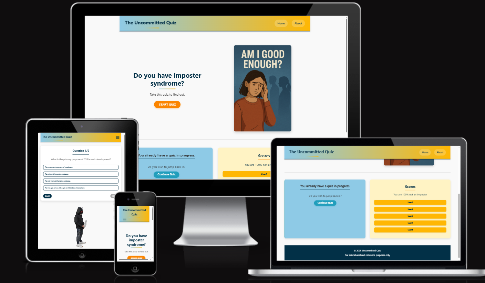

# 🎭 The Uncommitted

*To Visit the Live Link click* 👉 **[Here](https://uncommitted-quiz-1141a858de24.herokuapp.com/)**

## Table of Contents

- [🎭 The Uncommitted](#-the-uncommitted)
  - [Table of Contents](#table-of-contents)
- [🧑‍💻 User Experience Design(UX)](#-user-experience-designux)
  - [The-Strategy-Plane](#the-strategy-plane)
- [✍🏻 The Structure Plane](#-the-structure-plane)
  - [The Surface Plane](#the-surface-plane)
- [📝 Testing](#-testing)
- [🚀 Deployment](#-deployment)
- [🌟 Credits](#-credits)
- [💌 Acknowledgments](#-acknowledgments)

# 🧑‍💻 User Experience Design(UX)
  ## The-Strategy-Plane

# ✍🏻 The Structure Plane

  - ## Features
     - Header
     - Footer
     - Home Page
  - ## The Skeleton Plane
    - ### Wireframes
      - landing page 
      - landing page mobile 
      - quiz page 
      -  quiz page mobile 
      - end of quiz 
      - end of quiz mobile 
    - 
    - ### Database Design

## The Surface Plane
 - ## Design
    - ### Colour Scheme
      - 
    - ### Typography
      - This font stack ("Segoe UI", Tahoma, Geneva, Verdana, sans-serif) represents a cross-platform system font combination designed to ensure consistent typography across operating systems while prioritizing readability
        - Segoe UI: Primary font for modern Windows systems (Windows 10/11, Microsoft apps)
        - Tahoma: Fallback for older Windows systems (Windows XP/7)
        - Geneva: macOS/Linux fallback (pre-installed on Apple systems)
        - Verdana: Universal web-safe font (installed on 99% of devices)
        - sans-serif: Generic fallback to the system's default sans-serif font
      - which is ideal for:
        - Technical documentation (clear hierarchy)
        - Open-source projects (works across all OSes)
        - Long-form content (prevents eye strain)
        - Minimalist designs (avoids flashy typography)
    - ### Imagery
 - ## Technolgies
    - ### Languages
    - ### Frameworks and libraries
    - ### Databases
    - ### Other tools

# 📝 Testing

# 🚀 Deployment

# 🌟 Credits

# 💌 Acknowledgments
  - [Mark Butler](https://github.com/Mbutler1991)
  - [Ojarvey Lowman](https://github.com/OJarvey)
  - [Mirjane Cale](https://github.com/mirjanacale)
  - [Jawahir Abdul Bari](https://github.com/Jawahir01)
