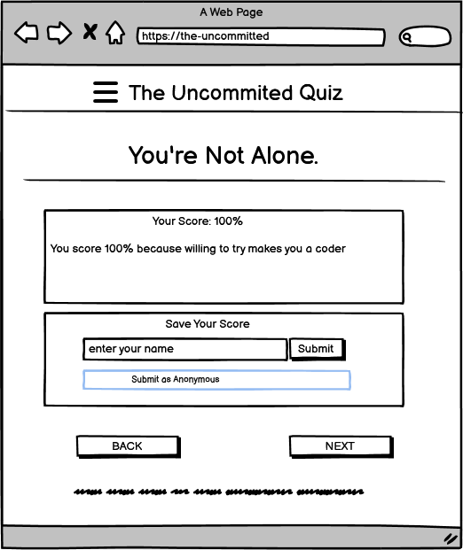

# 🎭 The Uncommitted

🧠 CodeConfident Quiz which is friendly reminder that you know more than you think!

This lighthearted coding quiz tackles imposter syndrome head-on by revealing a secret at the end: every answer was correct all along. Through bite-sized programming questions, we help developers:

💡 Challenge self-doubt with instant validation
💻 Reframe mistakes as learning opportunities
🚀 Boost confidence with positive reinforcement

*"Wait... but I thought I was wrong?"* That's the point! Designed to mirror how imposter syndrome distorts our self-perception, this experience ends with a crucial reminder:

✨ "You had the right answers all along - trust your coding instincts!"

Perfect for developers feeling stuck in the "I'm not good enough" loop. Take the quiz, see the truth in the results, and walk away a little more confident in your skills.

*To Visit the Live Link click* 👉 **[Here](https://uncommitted-quiz-1141a858de24.herokuapp.com/)**

## Table of Contents

- [🎭 The Uncommitted](#-the-uncommitted)
  - [Table of Contents](#table-of-contents)
- [🧑‍💻 User Experience Design(UX)](#-user-experience-designux)
  - [The-Strategy-Plane](#the-strategy-plane)
- [✍🏻 The Structure Plane](#-the-structure-plane)
  - [The Surface Plane](#the-surface-plane)
- [📝 Testing](#-testing)
- [🚀 Deployment](#-deployment)
- [🌟 Credits](#-credits)
- [💌 Acknowledgments](#-acknowledgments)

# 🧑‍💻 User Experience Design(UX)
  ## The-Strategy-Plane
   🎯 Key UX Features
        1. Anxiety-Reducing Quiz Flow
          No Wrong Answers: All choices marked "correct" post-quiz (secret until end)
          Zero Timer: No pressure to rush decisions
          Progress Visualization: Subtle "Question 2/5" counter (no % metrics)
          
  2. 3D Model Interaction
        Stress Relief: Draggable demon mask (symbolizing imposter syndrome)
        Visual Metaphor: Rotating/zooming represents "viewing doubts from all angles"
        Error Handling: Friendly retry button with emoji ⚠️ → 😊

        3. Confidence-Building Microcopy
        Affirmations: "You had it right all along" (end screen)

        Neutral Labels: "Continue" instead of "Next"

        Score Display: Always "100%" with personalized feedback

# ✍🏻 The Structure Plane

  - ## Features
     - Header
      - 
     - Footer
      - 
     - Home Page
      - 
     - Quiz
      - 
     - End of quiz
      - 
     - About Page
      - 

  - ## The Skeleton Plane
    - ### Wireframes

     - landing page
      - 
      - landing page mobile 
       - 
      - quiz page 
       - 
      - quiz page mobile 
       - 
      - end of quiz 
       - 
      - end of quiz mobile 
       - 

## The Surface Plane
 - ## Design
    - ### Colour Scheme
      - 
    - ### Typography
      - This font stack ("Segoe UI", Tahoma, Geneva, Verdana, sans-serif) represents a cross-platform system font combination designed to ensure consistent typography across operating systems while prioritizing readability
        - Segoe UI: Primary font for modern Windows systems (Windows 10/11, Microsoft apps)
        - Tahoma: Fallback for older Windows systems (Windows XP/7)
        - Geneva: macOS/Linux fallback (pre-installed on Apple systems)
        - Verdana: Universal web-safe font (installed on 99% of devices)
        - sans-serif: Generic fallback to the system's default sans-serif font
      - which is ideal for:
        - Technical documentation (clear hierarchy)
        - Open-source projects (works across all OSes)
        - Long-form content (prevents eye strain)
        - Minimalist designs (avoids flashy typography)

 - ## Technolgies
    - ### Languages
      - Django the primary language used to develop the server-side of the website.
      -	JS: the primary language used to develop interactive components of the website.
      -	HTML: the markup language used to create the website.
      -	CSS: the styling language used to style the website.

    - ### Other tools
      -	Git: the version control system used to manage the code.
      -	Pip: the package manager used to install the dependencies.
      -	GitHub: used to host the website's source code.
      -	Chrome DevTools: was used to debug the website.
      -	Font Awesome: was used to create the icons used on the website.
      -	Google: was used for random photos of children and teachers.
      -	BootStrap5: was used to create responsive elements.

# 📝 Testing
  - **Manual Testing**
    - ### Core Test Cases  

| Test Case              | Steps                                                                 | Expected Result                                                                 |
|------------------------|-----------------------------------------------------------------------|---------------------------------------------------------------------------------|
| Complete Quiz Flow     | 1. Start quiz 2. Answer 5 questions 3. Submit score             | Always shows 100% score Score appears in leaderboard                        |
| 3D Model Interaction   | 1. Load quiz page 2. Rotate model 3. Trigger error (block CDN) | Model loads ≤3s Error overlay appears Retry button functional             |
| Score Persistence      | 1. Submit as "Test User" 2. Refresh page 3. Submit anonymously  | Both entries in localStorage Anonymous shows as "Anonymous"                 |
| Cross-Device Progress  | 1. Start on desktop 2. Continue on mobile                         | Consistent question number Session maintained via cookies                   |
    
   - ### 🛣️ End-to-End Testing
     - #### Scenario 1: First-Time User Journey  
        ✅ **Expected Flow**  
        1. `/` → Sees "Start Quiz" as primary button  
        2. Answers 5 questions → All marked correct (💡 Secret mechanic)  
        3. Submits as "CodeNewbie" → Appears in leaderboard  
        4. Returns home → "Continue Quiz" hidden  

        #### Scenario 2: Progress Recovery  
        ✅ **Expected Behavior**  
        1. Answers Q1-3 → Closes tab  
        2. Reopens site → Sees "Continue Quiz"  
        3. Completes Q4-5 → Total shows "5/5"  
        4. Leaderboard updates → Most recent first  

        #### Scenario 3: Accessibility Check  
        ♿ **Key Requirements**  
        - Mobile menu closes on selection (✅ Pass)  
        - Alt text for 3D model (❌ Needs improvement)  
        - Keyboard navigation (⚠️ Partial support)  

  - **LightHouse**
    - *Desktop:*
       - Home Page
         - 
       - Quiz Page
         - 
       - About Page
         - 

    - *Mobile:*
      - Home Page
         - 
       - Quiz Page
         - 
       - About Page
         - 

# 🚀 Deployment

This project utilizes [Heroku](http://heroku.com) , for deployment, allowing developers to build, run, and manage applications in the cloud.
Follow these steps to deploy the ArtBlog on Heroku:

1. Create a New Heroku App
- Log in to Heroku or sign up for a new account.
- Navigate to your Heroku dashboard and click on the "New" button.
- Select "Create new app" from the dropdown menu.
- Choose a unique name for your app, select a region (EU or USA), and click "Create app".
2. Configure Environment Variables
- In your app's settings, navigate to the "Config Vars" section.
- Click on "Reveal Config Vars" and add the following variables:
  - PORT: Set the value to 8000.
  - Any other confidential credentials or configuration settings required by the blog.
3. Add Buildpacks
- In the "Buildpacks" section, add the following buildpacks in the specified order:
  - Python
  - Node.js
4. Prepare Required Files
- Ensure your project includes the following files:
  - requirements.txt: Contains the project's Python dependencies.
  - Procfile: Specifies the commands to run the app.
5. Connect GitHub Repository

- Under the "Deploy" tab, select "GitHub" as the deployment method.
- Connect your GitHub repository to the Heroku app.
- Enable automatic deploys for continuous deployment.
6. Deploy Your App
- Trigger a manual deployment by clicking "Deploy Branch" or wait for automatic deployments to occur.
- Once deployed successfully, your blog will be accessible via the provided Heroku URL.

### Local Deployment

This project can be cloned or forked in order to make a local copy on your own system.

#### Cloning

You can clone the repository by following these steps:

1. Go to the [GitHub repository](https://github.com/Mbutler1991/the-uncommitted)
2. Locate the Code button above the list of files and click it
3. Select if you prefer to clone using HTTPS, SSH, or GitHub CLI and click the copy button to copy the URL to your clipboard
4. Open Git Bash or Terminal
5. Change the current working directory to the one where you want the cloned directory
6. In your IDE Terminal, type the following command to clone my repository:
   - `git clone https://github.com/Mbutler1991/the-uncommitted`
7. Press Enter to create your local clone.

Alternatively, if using Gitpod, you can click below to create your own workspace using this repository.

Please note that in order to directly open the project in Gitpod, you need to have the browser extension installed.
A tutorial on how to do that can be found [here](https://www.gitpod.io/docs/configure/user-settings/browser-extension).

#### Forking

By forking the GitHub Repository, we make a copy of the original repository on our GitHub account to view and/or make changes without affecting the original owner's repository.
You can fork this repository by using the following steps:

1. Log in to GitHub and locate the [GitHub Repository](https://github.com/Mbutler1991/the-uncommitted)
2. At the top of the Repository (not top of page) just above the "Settings" Button on the menu, locate the "Fork" Button.
3. Once clicked, you should now have a copy of the original repository in your own GitHub account!

### Local VS Deployment

There are no major differences between the local (Gitpod) version and the deployed (GitHub Pages) version that I'm aware of.

# 🌟 Credits
  - [ChatGPT](https://chat.openai.com/): was used to assist with codes and to give more formal sentences for the website and README file.
  - [Favicon.io](https://favicon.io/): was used to convert the logo image into favicon.

# 💌 Acknowledgments
  - [Mark Butler](https://github.com/Mbutler1991)
  - [Ojarvey Lowman](https://github.com/OJarvey)
  - [Mirjane Cale](https://github.com/mirjanacale)
  - [Jawahir Abdul Bari](https://github.com/Jawahir01)
