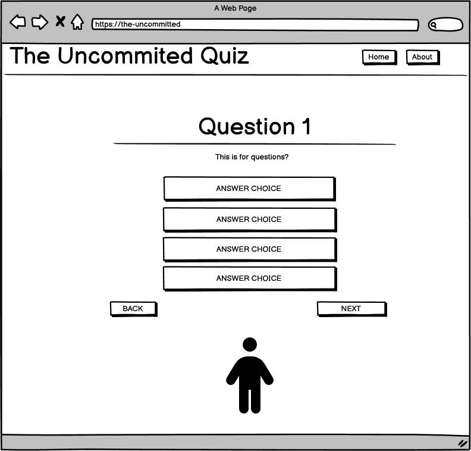

# 🎭 The Uncommitted

*To Visit the Live Link click* 👉 **[Here](https://uncommitted-quiz-1141a858de24.herokuapp.com/)**

## Table of Contents

- [🎭 The Uncommitted](#-the-uncommitted)
  - [Table of Contents](#table-of-contents)
- [🧑‍💻 User Experience Design(UX)](#-user-experience-designux)
  - [The-Strategy-Plane](#the-strategy-plane)
- [✍🏻 The Structure Plane](#-the-structure-plane)
  - [The Surface Plane](#the-surface-plane)
- [📝 Testing](#-testing)
- [🚀 Deployment](#-deployment)
- [🌟 Credits](#-credits)
- [💌 Acknowledgments](#-acknowledgments)

# 🧑‍💻 User Experience Design(UX)
  ## The-Strategy-Plane

# ✍🏻 The Structure Plane

  - ## Features
     - Header
     - Footer
     - Home Page
  - ## The Skeleton Plane
    - ### Wireframes
    ## Wireframe
***

Wireframe - Homepage  
  

 

Wireframe - About page 
  

 

Wireframe - New Post
  

    

Wireframe - SignUp page 
  

 

Wireframe - Mobile 
  

              

      - landing page 
      - landing page mobile 
      - quiz page 
      -  quiz page mobile 
      - end of quiz 
      - end of quiz mobile 
    - 
    - ### Database Design

## The Surface Plane
 - ## Design
    - ### Colour Scheme
      - 
    - ### Typography
      - This font stack ("Segoe UI", Tahoma, Geneva, Verdana, sans-serif) represents a cross-platform system font combination designed to ensure consistent typography across operating systems while prioritizing readability
        - Segoe UI: Primary font for modern Windows systems (Windows 10/11, Microsoft apps)
        - Tahoma: Fallback for older Windows systems (Windows XP/7)
        - Geneva: macOS/Linux fallback (pre-installed on Apple systems)
        - Verdana: Universal web-safe font (installed on 99% of devices)
        - sans-serif: Generic fallback to the system's default sans-serif font
      - which is ideal for:
        - Technical documentation (clear hierarchy)
        - Open-source projects (works across all OSes)
        - Long-form content (prevents eye strain)
        - Minimalist designs (avoids flashy typography)
    - ### Imagery
 - ## Technolgies
    - ### Languages
    - ### Frameworks and libraries
    - ### Databases
    - ### Other tools

# 📝 Testing

# 🚀 Deployment
# Deployment
## Deployment
This project utilizes [Heroku](http://heroku.com) , for deployment, allowing developers to build, run, and manage applications in the cloud.
Follow these steps to deploy the ArtBlog on Heroku:

1. Create a New Heroku App
- Log in to Heroku or sign up for a new account.
- Navigate to your Heroku dashboard and click on the "New" button.
- Select "Create new app" from the dropdown menu.
- Choose a unique name for your app, select a region (EU or USA), and click "Create app".
2. Configure Environment Variables
- In your app's settings, navigate to the "Config Vars" section.
- Click on "Reveal Config Vars" and add the following variables:
  - PORT: Set the value to 8000.
  - Any other confidential credentials or configuration settings required by the blog.
3. Add Buildpacks
- In the "Buildpacks" section, add the following buildpacks in the specified order:
  - Python
  - Node.js
4. Prepare Required Files
- Ensure your project includes the following files:
  - requirements.txt: Contains the project's Python dependencies.
  - Procfile: Specifies the commands to run the app.
5. Connect GitHub Repository

- Under the "Deploy" tab, select "GitHub" as the deployment method.
- Connect your GitHub repository to the Heroku app.
- Enable automatic deploys for continuous deployment.
6. Deploy Your App
- Trigger a manual deployment by clicking "Deploy Branch" or wait for automatic deployments to occur.
- Once deployed successfully, your blog will be accessible via the provided Heroku URL.

## Deployment

The site was deployed to GitHub Pages. The steps to deploy are as follows:

- In the [GitHub repository](), navigate to the Settings tab
- From the source section drop-down menu, select the **Main** Branch, then click "Save".
- The page will be automatically refreshed with a detailed ribbon display to indicate the successful deployment.

The live link can be found [here]()

### Local Deployment

This project can be cloned or forked in order to make a local copy on your own system.

#### Cloning

You can clone the repository by following these steps:

1. Go to the [GitHub repository]()
2. Locate the Code button above the list of files and click it
3. Select if you prefer to clone using HTTPS, SSH, or GitHub CLI and click the copy button to copy the URL to your clipboard
4. Open Git Bash or Terminal
5. Change the current working directory to the one where you want the cloned directory
6. In your IDE Terminal, type the following command to clone my repository:
   - ``
7. Press Enter to create your local clone.

Alternatively, if using Gitpod, you can click below to create your own workspace using this repository.

Please note that in order to directly open the project in Gitpod, you need to have the browser extension installed.
A tutorial on how to do that can be found [here](https://www.gitpod.io/docs/configure/user-settings/browser-extension).

#### Forking

By forking the GitHub Repository, we make a copy of the original repository on our GitHub account to view and/or make changes without affecting the original owner's repository.
You can fork this repository by using the following steps:

1. Log in to GitHub and locate the [GitHub Repository]()
2. At the top of the Repository (not top of page) just above the "Settings" Button on the menu, locate the "Fork" Button.
3. Once clicked, you should now have a copy of the original repository in your own GitHub account!

### Local VS Deployment

There are no major differences between the local (Gitpod) version and the deployed (GitHub Pages) version that I'm aware of.

# 🌟 Credits

# 💌 Acknowledgments
  - [Mark Butler](https://github.com/Mbutler1991)
  - [Ojarvey Lowman](https://github.com/OJarvey)
  - [Mirjane Cale](https://github.com/mirjanacale)
  - [Jawahir Abdul Bari](https://github.com/Jawahir01)
